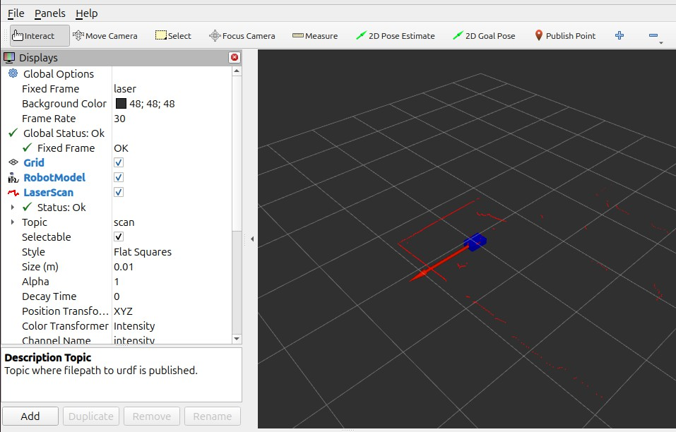

# RPLIDAR A1 – Laser Scanner ROS2 Project

[](https://docs.ros.org/en/jazzy/)
[](LICENSE)

---

## Overview

This project integrates the **RPLIDAR A1** 360° laser scanner with **ROS2 Jazzy** to perform:

- Real-time 2D laser scanning  
- Mapping using SLAM  
- Visualization in RViz2  

It is designed to be used in robotics projects, including autonomous navigation and environment mapping.

---

## Project Structure

```text
lidar/
│── my_robot/                # Custom ROS2 package
│   ├── launch/              # Launch files
│   ├── my_robot/            # ROS2 nodes and scripts
│   └── test/                # Unit tests for package
│── rplidar_ros/             # Official ROS2 driver (submodule)
│── media/                   # Images, screenshots, videos
│   └── lidar_scan.png       # Example LIDAR scan
│── README.md                # This file

```

---

## Screenshot



> Example of a 2D LIDAR scan captured using this project.

---

## Prerequisites

- **Ubuntu 22.04 LTS** (development PC)  
- **ROS2 Jazzy** installed  
- \`colcon\` build tool  
- \`rplidar_ros\` submodule (already included)

---

## Setup Instructions

1. **Clone the repository recursively** (to include the submodule):

```bash
git clone --recursive https://github.com/Manar-Daghsni/RPLIDAR-A1-ROS2.git
cd RPLIDAR-A1-ROS2
```

2. **Build the workspace**:

```bash
colcon build
source install/setup.bash
```

3. **Verify the submodule**:

\`\`\`bash
git submodule update --init --recursive
\`\`\`

---

## Running the Project

1. **Launch the LIDAR node**:

\`\`\`bash
ros2 launch my_robot lidar_launch.py
\`\`\`

2. **Open RViz2 for visualization**:

\`\`\`bash
rviz2
\`\`\`

- Add a **LaserScan** display and subscribe to the topic published by the LIDAR node.  
- You should see the 360° laser scan in real time.

---

## Notes

- The \`rplidar_ros\` submodule points to the official ROS2 driver.  
- All paths and configurations assume the standard ROS2 workspace layout.  
- Screenshots and media are stored in the \`media/\` folder.  
---


## License

This project is licensed under the **MIT License**. See [LICENSE](LICENSE) for details.

---

## References

- [RPLIDAR A1 Official Documentation](https://www.slamtec.com/en/Lidar/A1)  
- [rplidar_ros GitHub Repo](https://github.com/robopeak/rplidar_ros)  
- [ROS2 Jazzy Documentation](https://docs.ros.org/en/jazzy/)"
